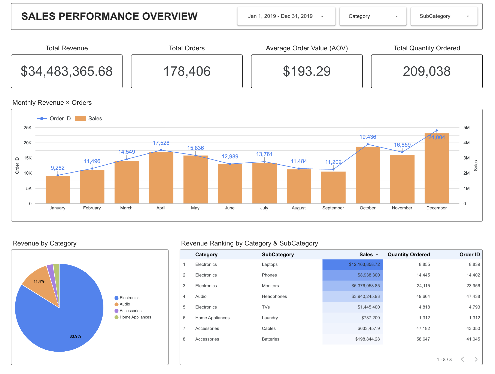

# U.S. E-Commerce Sales Analytics Dashboard (2019)

> **Built to answer:** Where should a U.S. e-commerce business invest to grow revenue — and when?

An end-to-end sales analytics project analyzing 185,916 transactions across 19 products and 9 U.S. cities. Built with Google Looker Studio, powered by Python data pipelines.

**[View Live Dashboard →](https://lookerstudio.google.com/reporting/6ce179bf-e92e-4a4a-b607-d5095ab0e2a6)**



---

## Project Overview

| | |
|---|---|
| **Data** | 185,916 orders · 19 products · 9 U.S. cities · Full year 2019 |
| **Tools** | Google Looker Studio · Python (pandas) · Jupyter Notebook |
| **Output** | 6-page interactive dashboard + bilingual insight report (EN/VI) |

---

## Key Findings

### 1. Volume-Driven Business Model
Revenue growth is driven by **order volume, not price**. AOV remains stable at ~$193 year-round. Top 3 subcategories (Laptops, Phones, Monitors) consistently account for **~80% of revenue** across all seasons, months, and time of day — product mix is a structural constant.

### 2. Revenue Cycle — 3 Distinct Phases
| Phase | Period | Revenue Range |
|---|---|---|
| Growth | Jan → Apr | $1.81M → $3.39M |
| Decline | May → Sep | $3.15M → $2.10M (2-wave pattern) |
| Surge | Oct → Dec | $3.74M → $4.61M (twin peaks at Oct & Dec) |

**→ Q4 (Oct–Dec) alone drives 33% of annual revenue** — marketing budget should front-load Oct–Dec, not spread evenly across the year.

### 3. Twin Peak Purchasing Pattern
Online shopping forms a **"Twin Peak" model** daily — 51.9% of all orders concentrated in just 8 hours:
- **Noon zone (10–13h):** Built up from commute → tab shopping → lunch break burst
- **Evening zone (18–21h):** Single concentrated burst — home, relaxed, longest free time of day
- **Golden Hour:** 19:00 is the absolute daily peak, hottest in 5/7 days on the heatmap

### 4. Product Mix Is Stable Across All Hours and Months
SubCategory share is virtually **identical across all hours AND all months** (Laptops always ~35%, Phones ~26%). Time of day changes *how many* people buy — not *what* they buy, disproving the assumption that evening shoppers buy more expensive products.

---

## Dashboard Pages

| # | Page | Key Question |
|---|---|---|
| 1 | Sales Performance Overview | Revenue cycle, monthly trends, Growth/Decline/Surge phases |
| 2 | Purchasing Time Patterns | When do customers buy? Twin Peak model, hourly heatmap |
| 3 | Geographic Analysis | Which cities drive revenue? |
| 4 | Order Segmentation & Pricing | AOV distribution, order size patterns |
| 5 | Market Basket Analysis | Which products are bought together? |
| 6 | Product Performance | SubCategory breakdown, top products |

---

## Repository Structure

```
├── README.md
├── BI_Sales_Main.csv               # Main transaction data (185,916 rows, 2019 only)
├── BI_Order_Summary.csv            # Aggregated order-level data
├── BI_Product_Dim.csv              # Product dimension table
├── BI_Association_Rules.csv        # Market basket association rules
├── BI_Category_CoOccurrence.csv    # Category co-occurrence matrix
├── BI_SubCategory_CoOccurrence.csv # SubCategory co-occurrence matrix
├── Data_Dictionary.csv             # Field definitions
├── market_basket_analysis.ipynb    # Python notebook: association rules
└── E-Commerce Sales Analytics.pdf  # Full bilingual insight report (EN + VI)
```

---

*Tools: Python · pandas · Google Looker Studio*
